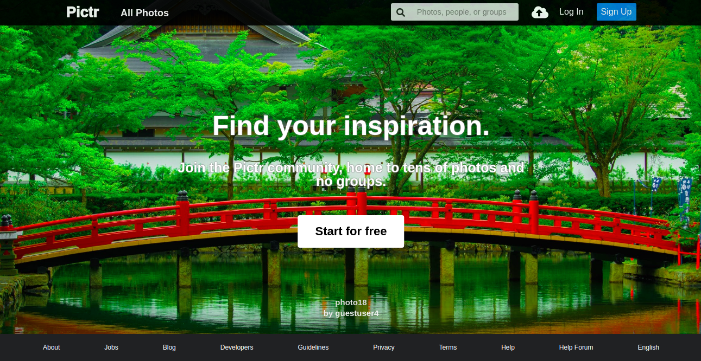
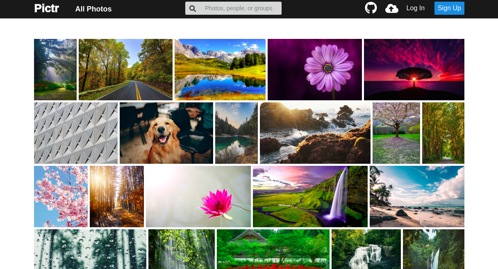
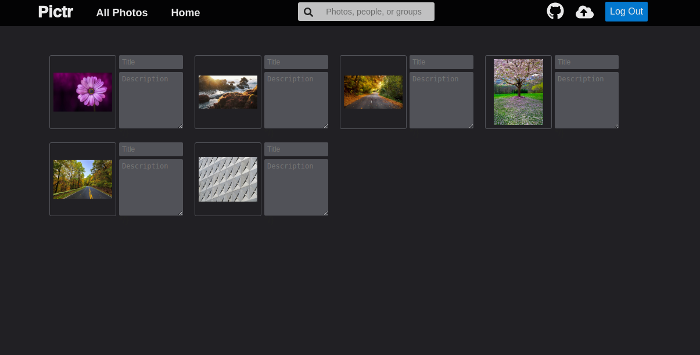
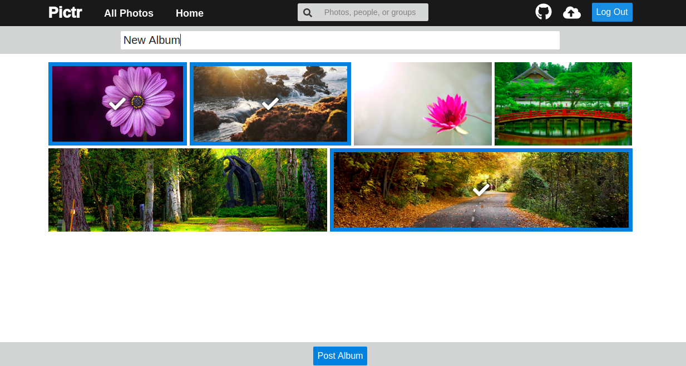

# Pictr
[Pictr live](https://pictrapp.herokuapp.com/#/)

Pictr is a full-stack web app that allows you to share photos with others. This app is made in the image of Flickr. It is built with Rails and PostreSQL backend, with AWS s3 storing the image files. The Frontend is built with React, Redux, and SASS



## Features

### Photos Index Page
The photos index page features a flexible layout that dynamically resizes images to fit within its container.



The dynamic resizing is acheived using flex-grow on the photo container. In order for the image inside to grow along with the container, a min width of 100% is needed.
```css
.photo-container {
  flex-grow: 1;
  position: relative;
  margin-right: 5px;
  margin-bottom: 5px;
  color: white;
  transition: opacity 0.5s;
  box-sizing: border-box;

  &:hover .hud {
    opacity: 100%;
  }
}

.index-photo {
  height: 150px;
  min-width: 100%;
  object-fit: cover;
}
```

### Posting Images
Pictr allows you to upload multiple photos at a time, making it easy for users to add as many photos as they want without any hassle
The images are stored on an AWS S3 bucket. 



In order to facilitate multiple image uploads efficiently, all the image data is saved in state as an object containing all the photos' information and is then sent to the backend as an array of photos, allowing the photos to be saved in the database using one api call.

```js
handleFileUpload(e) {
  const files = Array.from(e.currentTarget.files);

  files.forEach((file, idx) => {
    const fileReader = new FileReader();
    fileReader.onloadend = () => {
      this.setState({
        [idx]: {
          title: "",
          description: "",
          image: file,
          imageUrl: fileReader.result,
        },
      });
    };
    if (file) {
      fileReader.readAsDataURL(file);
    }
  });
}

handleSubmit(e) {
  e.preventDefault();
  const formData = new FormData();
  for (let photo of Object.values(this.state)) {
    formData.append(`photos[][title]`, photo.title);
    formData.append(`photos[][description]`, photo.description);
    formData.append(`photos[][image]`, photo.image);
    formData.append(`photos[][user_id]`, this.props.currentUser.id);
  }
  this.props
    .processForm(formData)
    .then(
      this.props.history.push(`/users/${this.props.currentUser.id}/photos`)
    );
}
```

### Albums

Users can create albums of photos that they own. They are able to interface with a ui that allows them to click on a photo to toggle its presence in the album, they included photos display a checkmark when clicked.



### Comments

Users are allowed to comment on photos, the comment they make will appear on that photo's show page, it features a link to their profile along with their profile picture, and comment body.

### Wiki
To view the schema documentation, frontend state layout, and general planning
go to the [wiki](https://github.com/rakinaa/full_stack_project/wiki).

### Features to implement in the future
+ Tags to label pictures with relevant information not present in the title
+ Seach functionality to allow users to search for key words and filter photos on the index page
+ Favoriting photos, allowing the user create a list of photos that they like
+ Groups letting users with common interests to post pictures and see the pictures of others in the group
